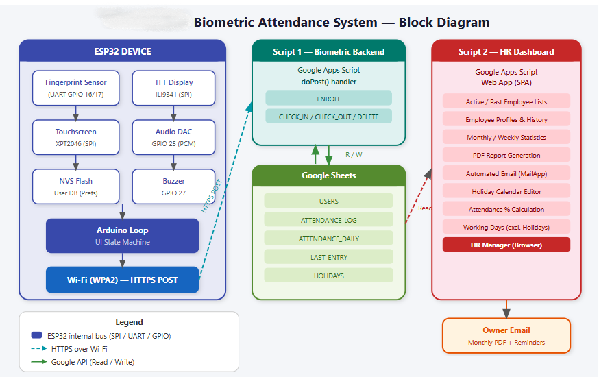

# Biometric Attendance System

> A full-stack, touchscreen biometric attendance solution built on the ESP32 platform — fingerprint scanning, real-time cloud sync via Google Sheets, and a professional HR dashboard powered by Google Apps Script.

Watch the demo here:
https://snehitt03.github.io/attendance_system/

<div align="center">
    
    <p><em>Figure 1: Workflow of the System</em></p>
  </div> 
  
---

## Table of Contents

- [Overview](#overview)
- [System Architecture](#system-architecture)
- [Hardware Components](#hardware-components)
- [Repository Structure](#repository-structure)
- [Firmware (ESP32)](#firmware-esp32)
  - [Dependencies](#dependencies)
  - [Configuration](#configuration)
  - [Flashing](#flashing)
- [Cloud Backend — Google Sheets + Apps Script (Script 1)](#cloud-backend--google-sheets--apps-script-script-1)
  - [Sheet Structure](#sheet-structure)
  - [API Endpoints](#api-endpoints)
- [HR Dashboard — Apps Script Web App (Script 2)](#hr-dashboard--apps-script-web-app-script-2)
  - [Features](#features)
  - [Deployment](#deployment)
  - [Auto Triggers](#auto-triggers)
- [Audio System](#audio-system)
- [Admin Panel](#admin-panel)
- [Enroll / Delete Flow](#enroll--delete-flow)
- [Getting Started](#getting-started)
- [Troubleshooting](#troubleshooting)

---

## Overview

QuantumCLK is a production-ready biometric attendance system that replaces manual registers and basic RFID solutions with fingerprint-verified check-in and check-out. The device is self-contained — it stores employee records in NVS flash, verifies identity using an optical fingerprint sensor, plays audio feedback, and POSTs structured JSON payloads to a Google Sheets backend over Wi-Fi in real time.

A separate Google Apps Script web application consumes the same spreadsheet and presents an HR manager dashboard with attendance statistics, employee profiles, report generation (PDF), automated email delivery, and a holiday calendar editor.

**Key capabilities at a glance:**

| Feature | Detail |
|---|---|
| Biometric sensor | Adafruit/R307-compatible UART fingerprint module |
| Display | 320 × 240 ILI9341 TFT with XPT2046 capacitive touchscreen |
| Connectivity | Wi-Fi (WPA2), HTTPS POST to Google Apps Script |
| Cloud storage | Google Sheets (5 sub-sheets) |
| Dashboard | Google Apps Script Web App — HTML/CSS/JS SPA |
| Audio feedback | PCM audio via ESP32 DAC (GPIO 25) |
| Local storage | NVS Preferences (survives power loss) |
| Admin security | Name + password + admin fingerprint triple-factor |

---

## System Architecture

```
┌─────────────────────────────────────────────────────────────────┐
│                        ESP32 DEVICE                             │
│                                                                 │
│  ┌─────────────┐   UART    ┌──────────────────┐                 │
│  │ Fingerprint │◄─────────►│  Adafruit_       │                 │
│  │  Sensor     │           │  Fingerprint lib │                 │
│  └─────────────┘           └────────┬─────────┘                 │
│                                     │                           │
│  ┌─────────────┐   SPI     ┌────────▼─────────┐                 │
│  │  XPT2046    │◄─────────►│   TFT_eSPI /     │                 │
│  │ Touchscreen │           │   TFT Display    │                 │
│  └─────────────┘           └────────┬─────────┘                 │
│                                     │                           │
│  ┌─────────────┐           ┌────────▼─────────┐                 │
│  │  DAC GPIO25 │           │   Arduino Loop   │                 │
│  │  (Audio)    │           │   State Machine  │                 │
│  └─────────────┘           └────────┬─────────┘                 │
│                                     │                           │
│  ┌─────────────┐           ┌────────▼─────────┐                 │
│  │  NVS Flash  │◄─────────►│  Preferences     │                 │
│  │  (Users DB) │           │  (Local Storage) │                 │
│  └─────────────┘           └────────┬─────────┘                 │
│                                     │  HTTPS POST               │
└─────────────────────────────────────┼───────────────────────────┘
                                      │
                              ┌───────▼────────┐
                              │  Wi-Fi / HTTPS │
                              └───────┬────────┘
                                      │
              ┌───────────────────────▼────────────────────────┐
              │          Google Apps Script (Script 1)         │
              │              Biometric Web App                 │
              │   doPost() — ENROLL / CHECK_IN / CHECK_OUT /   │
              │              DELETE                            │
              └───────────────────────┬────────────────────────┘
                                      │  Read / Write
                              ┌───────▼────────┐
                              │  Google Sheets │
                              │                │
                              │  • USERS       │
                              │  • ATTENDANCE  │
                              │    _DAILY      │
                              │  • ATTENDANCE  │
                              │    _LOG        │
                              │  • LAST_ENTRY  │
                              │  • HOLIDAYS    │
                              └───────┬────────┘
                                      │  Read
              ┌───────────────────────▼────────────────────────┐
              │          Google Apps Script (Script 2)         │
              │              HR Dashboard Web App              │
              │                                                │
              │  • Active / Past employee lists                │
              │  • Monthly & weekly statistics                 │
              │  • Attendance % per employee                   │
              │  • PDF report generation + email               │
              │  • Holiday calendar editor                     │
              └────────────────────────────────────────────────┘
```

---

## Hardware Components

| Component | Purpose | Interface |
|---|---|---|
| ESP32 DevKit | Main MCU | — |
| R307 / AS608 Fingerprint Sensor | Biometric capture & matching | UART (GPIO 16 RX, 17 TX) |
| ILI9341 320×240 TFT Display | UI rendering | SPI (TFT_eSPI) |
| XPT2046 Touch Controller | Touch input | SPI (CS GPIO 5, IRQ GPIO 21) |
| Passive Buzzer | Click feedback | GPIO 27 |
| Speaker / Amp | Audio playback | DAC GPIO 25 |

> **Wiring note:** Touch CS and TFT CS are on separate GPIOs. Ensure your `User_Setup.h` for TFT_eSPI matches your physical wiring before flashing.

---

## Repository Structure

```
QuantumCLK-Attendance/
│
├── Audio Header Files/          # PCM audio assets + conversion tooling
│   ├── checkin_success.h        # "Check-in successful" audio
│   ├── checkout_success.h       # "Check-out successful" audio
│   ├── enrollment_success.h     # "Enrollment successful" audio
│   ├── verification_valid.h     # "Access granted" audio
│   ├── verification_invalid.h   # "Access denied" audio
│   └── wav_to_header.py         # Python script: .wav → C int16_t[] header
│
├── Demo/                        # Photos / video of the running system
│
├── Attendance_system.ino        # Main Arduino sketch (ESP32 firmware)
├── audio_only_testing.txt       # Isolated audio playback test sketch
├── logo.h                       # Company logo as a 55×55 RGB565 array
├── main_code.txt                # Legacy / reference copy of the main sketch
│
├── debug.cfg                    # OpenOCD debug configuration
├── debug_custom.json            # VS Code Cortex-Debug launch profile
├── esp32.svd                    # SVD peripheral register map (for debugging)
│
└── README.md                    # This file
```

> **Google Apps Script files** (not in this repo — deployed separately on Google):
> - `Script1/Code.gs` — Biometric web-app backend (receives POSTs from ESP32)
> - `Script2/Code.gs` — HR Dashboard backend
> - `Script2/dashboard.html` — HR Dashboard frontend SPA
> - `Script2/appsscript.json` — OAuth scopes manifest

---

## Firmware (ESP32)

### Dependencies

Install the following libraries via the Arduino Library Manager or PlatformIO:

| Library | Purpose |
|---|---|
| `Adafruit Fingerprint Sensor Library` | UART fingerprint module driver |
| `TFT_eSPI` | High-performance SPI TFT display driver |
| `XPT2046_Touchscreen` | Resistive touch controller driver |
| `WiFi` (built-in ESP32) | Wi-Fi connectivity |
| `HTTPClient` (built-in ESP32) | HTTPS POST requests |
| `Preferences` (built-in ESP32) | NVS persistent key-value storage |

### Configuration

Open `Attendance_system.ino` and edit the constants near the top of the file:

```cpp
// Wi-Fi credentials
const char* WIFI_SSID = "your_wifi_name";
const char* WIFI_PASS = "your_wifi_password";

// Google Apps Script Web App URL (Script 1 deployment URL)
const char* SERVER_URL = "https://script.google.com/macros/s/YOUR_DEPLOYMENT_ID/exec";

// Default admin credentials (changed after first login)
const String ADMIN_DEFAULT_NAME = "ADMIN";
const String ADMIN_DEFAULT_PASS = "1234";
```

Also configure `TFT_eSPI` by editing the `User_Setup.h` file inside the TFT_eSPI library folder to match your pin wiring.

### Flashing

1. Select board: **ESP32 Dev Module**
2. Upload speed: **921600**
3. Partition scheme: **Default 4MB with spiffs** (or any scheme with sufficient NVS space)
4. Flash the sketch via Arduino IDE or PlatformIO

On first boot the device will:
- Connect to Wi-Fi (8-second timeout)
- Load any saved users from NVS
- Show the home screen with ENROLL / DELETE / ADMIN buttons

---

## Cloud Backend — Google Sheets + Apps Script (Script 1)

Script 1 is a standalone Google Apps Script project attached to the Google Spreadsheet. It exposes a `doPost()` HTTP endpoint that the ESP32 calls after every biometric event.

### Sheet Structure

The spreadsheet contains five sheets:

| Sheet | Columns | Purpose |
|---|---|---|
| `USERS` | ID, Name, Active, Joined, Device | Employee master list |
| `ATTENDANCE_LOG` | Date, Time, UID, Name, Mode, Device | Raw event log (every punch) |
| `ATTENDANCE_DAILY` | Date, UID, Name, IN_Time, OUT_Time, Work_Hours | Paired daily records |
| `LAST_ENTRY` | UID, Mode, Timestamp | Latest punch per employee (deduplication) |
| `HOLIDAYS` | Date (dd/MM/yyyy), Label | Company holidays (edited via dashboard) |

### API Endpoints

All requests are HTTP POST with `Content-Type: application/json`.

**Enroll a new employee:**
```json
{
  "mode": "ENROLL",
  "employee_id": "E001",
  "employee_name": "Ronin Kumar",
  "device": "GATE_1",
  "admin_verified": true
}
```

**Record a check-in or check-out:**
```json
{
  "action": "CHECK_IN",
  "employee_id": "E001",
  "employee_name": "Ronin Kumar",
  "device": "GATE_1"
}
```

**Delete an employee:**
```json
{
  "action": "DELETE",
  "employee_id": "E001",
  "employee_name": "Ronin Kumar"
}
```

Possible response strings: `CHECK_IN_OK`, `CHECK_OUT_OK`, `ENROLL_SUCCESS`, `DELETE_SUCCESS`, `USER_NOT_FOUND`, `ADMIN_NOT_VERIFIED`, `UID_MISSING`, `SHEET_CONFIG_ERROR`.

---

## HR Dashboard — Apps Script Web App (Script 2)

Script 2 is a separate Google Apps Script project that reads from the same spreadsheet and serves a single-page HTML dashboard to HR managers via a web browser.

### Features

- **Active & Past Employees** — searchable, clickable table of all staff
- **Employee Profile** — per-employee attendance history, hours worked, present/absent breakdown, attendance rate percentage
- **Statistics Page** — monthly summary cards (total headcount, avg hours, attendance %), sortable breakdown table
- **PDF Report Generation** — monthly and weekly reports exported as PDF files stored in Google Drive, with a direct download link
- **Automated Email Delivery** — monthly reports emailed automatically to the owner on the 1st of each month
- **Holiday Calendar Editor** — month-navigable calendar; click any day to mark/unmark as a company holiday; holidays are excluded from working-day calculations across all statistics
- **Month-end Reminder** — in-app toast notification on days 28–31 reminding the owner to set the following month's holidays

### Deployment

1. Create a new Apps Script project at [script.google.com](https://script.google.com)
2. Add three files: `Code.gs`, `dashboard.html`, and `appsscript.json`
3. In `Code.gs`, set:
   ```js
   const SPREADSHEET_ID = "your_spreadsheet_id";
   const OWNER_EMAIL    = "owner@yourcompany.com";
   const COMPANY_NAME   = "Your Company Name";
   ```
4. Replace `appsscript.json` contents with the provided manifest (ensures Gmail scope is authorised)
5. Click **Deploy → New deployment → Web App**
   - Execute as: **Me**
   - Who has access: **Anyone** (requires Google login)
6. Approve the permission dialog — Gmail send access must be granted
7. Run `testEmail()` from the editor to confirm email delivery works

### Auto Triggers

Run these functions **once** from the Apps Script editor to install time-based triggers:

| Function | When it fires | What it does |
|---|---|---|
| `createMonthlyReportTrigger()` | 1st of every month at 7 AM | Generates previous month's PDF and emails it to the owner |
| `createHolidayReminderTrigger()` | 28th of every month at 9 AM | Emails the owner asking them to set next month's holidays |

---

## Audio System

Audio files are stored as C header files containing `int16_t` PCM arrays sampled at 16 kHz. Playback is via the ESP32's built-in 8-bit DAC on GPIO 25.

**To add or replace a sound:**

1. Prepare a `.wav` file at 16 kHz, mono, 16-bit PCM
2. Run the conversion script:
   ```bash
   cd "Audio Header Files"
   python wav_to_header.py your_sound.wav your_sound
   ```
   This generates `your_sound.h` with a `your_sound[]` array and `your_sound_len` constant.
3. Include the header in the sketch and call:
   ```cpp
   playAudio(your_sound, your_sound_len);
   ```

| Sound file | Trigger |
|---|---|
| `checkin_success.h` | Successful check-in |
| `checkout_success.h` | Successful check-out |
| `enrollment_success.h` | New fingerprint enrolled |
| `verification_valid.h` | Fingerprint matched |
| `verification_invalid.h` | Fingerprint rejected |

---

## Admin Panel

Access the admin panel from the home screen by tapping **ADMIN** and entering the admin name and password (default: `ADMIN` / `1234`).

The admin menu offers two operations:

| Option | Description |
|---|---|
| **CHG FINGER** | Re-authenticate with credentials, then enroll a new admin fingerprint. The old fingerprint is replaced. |
| **CHG CRED** | Change the admin username and password. Saved immediately to NVS flash. |

> **Security model:** Enrolling a new employee requires the admin fingerprint to be placed on the sensor first, providing a hardware second factor. Deleting an employee also requires admin fingerprint verification. Credential changes require the current password.

---

## Enroll / Delete Flow

### Enrolling a New Employee

```
HOME → ENROLL button
  └─► Place Admin Fingerprint (hardware auth)
        └─► Type Employee Name → OK
              └─► Type Employee ID → OK
                    └─► Place Employee Finger (scan 1)
                          └─► Remove finger
                                └─► Place Employee Finger again (scan 2)
                                      └─► Model stored in sensor + NVS
                                            └─► POST to Google Sheets (ENROLL)
                                                  └─► Home screen
```

### Deleting an Employee

```
HOME → DELETE button
  └─► Place Admin Fingerprint (hardware auth)
        └─► Type Employee Name → OK
              └─► Fingerprint deleted from sensor
                    └─► Record removed from NVS
                          └─► POST to Google Sheets (DELETE)
                                └─► Home screen
```

---

## Getting Started

```bash
# 1. Clone the repository
git clone https://github.com/your-username/QuantumCLK-Attendance.git

# 2. Open the sketch
#    File → Open → Attendance_system.ino

# 3. Install libraries listed in the Dependencies section

# 4. Edit Wi-Fi credentials and SERVER_URL in the sketch

# 5. Configure TFT_eSPI pins in User_Setup.h

# 6. Flash to ESP32

# 7. Deploy Script 1 (biometric backend) to Google Apps Script
#    and paste the web app URL into SERVER_URL

# 8. Deploy Script 2 (HR dashboard) and open the web app URL
#    in a browser to access the dashboard
```

---

## Troubleshooting

| Symptom | Likely cause | Fix |
|---|---|---|
| `WiFi Failed` on boot | Wrong SSID/password or out of range | Check credentials; move closer to router |
| `Log Failed` on punch | `SERVER_URL` incorrect or Script 1 not deployed as "Anyone" | Re-deploy Script 1; verify URL |
| Fingerprint not detected | Dirty sensor glass | Clean sensor with dry cloth |
| Touch not registering | Miscalibrated touch mapping | Adjust `map()` range constants (200–3800) in sketch |
| Dashboard shows 0 hours | `ATTENDANCE_LOG` date/time cells stored as Date objects | Run `debugLogParsing()` from Apps Script editor to diagnose |
| Holidays not saving | Column A of HOLIDAYS sheet auto-converted to Date | Ensure `appsscript.json` is deployed with latest `Code.gs` |
| Email not delivered | Gmail scope not authorised | Delete deployment, re-deploy, re-authorise; run `testEmail()` |
| Audio distorted | Sample rate mismatch | Confirm `.wav` is 16 kHz mono 16-bit before converting |

---
